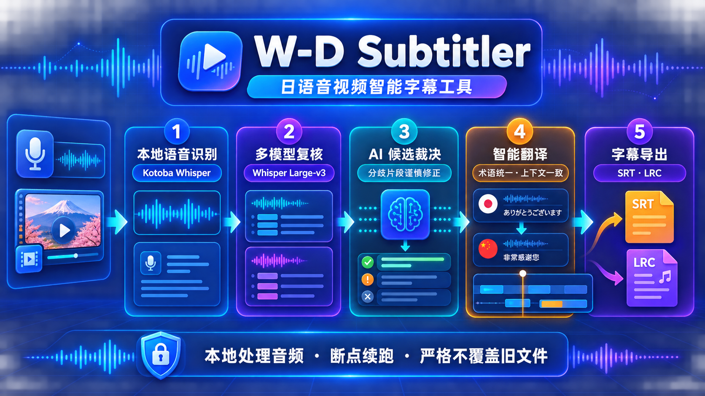
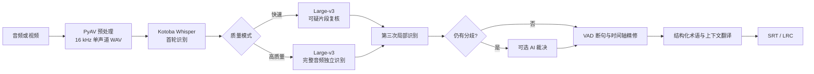

# W-D Subtitler



W-D Subtitler 是一款面向日语音频和视频的本地桌面字幕工具。它以 Kotoba Whisper
完成首轮识别，可选用 Whisper Large-v3 独立复核、第三次局部识别和 AI 候选裁决，
再通过 DeepSeek 生成中文字幕，最终导出 SRT 或 LRC 文件。

> 当前版本主要面向 Windows 和 NVIDIA CUDA 环境。ASR 在本机运行；启用术语分析、
> AI 裁决或翻译时，相关字幕文本会发送到用户配置的 DeepSeek API。

## 主要功能

- 支持 WAV、MP3、FLAC、M4A、MP4、MKV 等常见音视频格式；
- 使用 PyAV 探测媒体和选择音轨，不依赖系统 FFmpeg；
- 多音轨媒体默认优先日语音轨，也可以在界面中手动切换；
- Kotoba Whisper 本地日语识别，支持用户明确填写的日文热词；
- 高质量模式使用 Large-v3 独立识别完整音频；
- 模型分歧片段执行扩大边界的第三次局部识别；
- 可选 AI 候选裁决，只在三个识别候选仍无共识时调用；
- Silero VAD 辅助断句和轻量时间轴精修；
- 结构化术语表、上下文感知翻译和异常译文单行重试；
- 支持 SRT、LRC，以及翻译中断后的 `.partial` 部分字幕；
- 字幕严格无覆盖保存，同名文件自动编号；
- ASR 至翻译全流程断点恢复，未完成断点默认保留 7 天；
- ASR 子进程隔离、安全取消和安全关闭。

## 处理流程



## 环境要求

- Windows 10/11；
- Python 3.10 或更高版本；
- 推荐 NVIDIA 显卡和可用的 CUDA 12 运行时；
- CPU 模式可以回退运行，但 Large-v3 会明显更慢；
- 翻译及 AI 裁决需要用户自己的 DeepSeek API Key。

模型会在首次使用时由 Faster-Whisper 自动下载，需要预留模型缓存空间。

## 安装

```powershell
git clone <你的仓库地址>
cd W-D-Subtitler
python -m venv venv
.\venv\Scripts\python.exe -m pip install --upgrade pip
.\venv\Scripts\python.exe -m pip install -r requirements.txt
```

启动程序：

```powershell
.\venv\Scripts\python.exe main.py
```

详细操作见 [使用说明](docs/USAGE.md)。

## 配置与 API Key

程序首次保存设置后会把本机配置写入用户数据目录，而不是仓库：

```text
%LOCALAPPDATA%\W-D Subtitler\config.json
```

仓库中的 [config.example.json](config.example.json) 不包含密钥，只用于说明配置结构。
根目录的 `config.json` 和常见密钥文件也已被 `.gitignore` 排除。

提交代码前仍建议执行：

```powershell
git status --short
git grep -n -I -E "sk-[A-Za-z0-9_-]{16,}|Bearer[[:space:]]+[A-Za-z0-9_-]+"
```

如果真实 Key 曾经进入 Git 历史，必须立即在服务商控制台撤销并重新生成。更多信息见
[安全说明](SECURITY.md)。

## 质量模式

| 模式 | Kotoba | Large-v3 | 第三次识别 | 特点 |
| --- | --- | --- | --- | --- |
| 快速 | 完整音频 | 仅复核可疑片段 | 仅处理分歧片段 | 速度优先 |
| 高质量 | 完整音频 | 独立识别完整音频 | 仅处理分歧片段 | 准确性优先，耗时和显存占用更高 |

AI 候选裁决是独立开关，但依赖 Large-v3 和 API Key。它不会听到音频，只根据三个
识别候选、声学指标和前后文做保守选择，因此不能替代声学模型。

## 数据与隐私

- Kotoba、Large-v3、VAD 和媒体预处理在本机运行；
- 启用术语分析、AI 裁决或翻译后，相关字幕文本会发送到配置的 API 地址；
- API Key 保存在 `%LOCALAPPDATA%\W-D Subtitler\config.json`，不会写入仓库或断点；
- `logs/`、`checkpoints/`、`config.json` 和虚拟环境均已排除出版本控制；
- 请勿处理没有使用授权的媒体，也不要把私人字幕或日志附在公开 Issue 中。

## 测试

```powershell
.\venv\Scripts\python.exe -m unittest discover -s tests -v
.\venv\Scripts\python.exe -m compileall -q wd_subtitler tests
.\venv\Scripts\python.exe -m pip check
```

当前自动化测试覆盖媒体探测、ASR 质量判断、模型复核、AI 裁决、时间轴、翻译响应、
断点恢复、安全关闭和字幕原子保存。真实媒体与 GPU 模型仍建议在发布前进行手动验收。

## 项目结构

```text
W-D-Subtitler/
├─ main.py                     应用入口
├─ wd_subtitler/               主程序包
├─ tests/                      自动化测试
├─ docs/                       使用与架构文档
├─ assets/                     应用图标
├─ config.example.json         无密钥配置示例
├─ SECURITY.md                 安全与密钥说明
└─ CONTRIBUTING.md             贡献指南
```

内部结构和数据流见 [架构说明](docs/ARCHITECTURE.md)。

## 当前限制

- 只识别媒体音轨，不提取视频内嵌字幕；
- 不支持硬字幕 OCR；
- 不生成词级卡拉 OK 时间戳；
- 识别和翻译质量仍会受到录音质量、背景音乐、多人重叠说话和专有名词影响；
- 当前 API Key 以明文保存在本机配置中，后续版本计划接入系统凭据存储；
- 首次运行需要下载较大的 ASR 模型。

## 贡献与许可

欢迎通过 Issue 和 Pull Request 提交问题或改进，提交前请阅读
[贡献指南](CONTRIBUTING.md)。

本项目采用宽松、通用的 [MIT License](LICENSE)。你可以使用、复制、修改和分发代码，
但需要保留原始版权与许可声明。

同时请留意 Faster-Whisper、Kotoba Whisper、Whisper Large-v3、PyAV、DeepSeek API
及其模型各自的许可证和服务条款。
