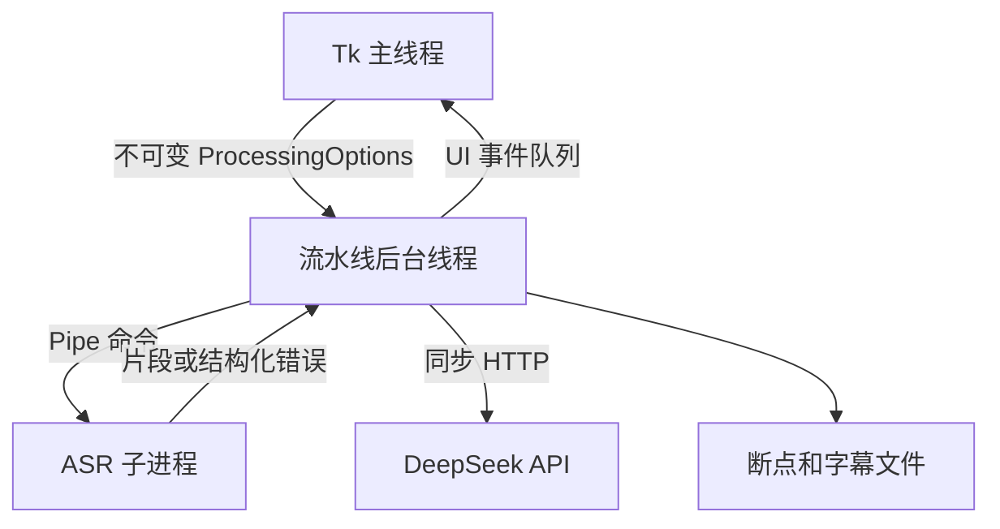

# W-D Subtitler 架构说明

## 设计目标

项目以桌面单机工具为边界，优先保证：

- Tkinter 主线程安全；
- 原生 ASR 崩溃与 GUI 进程隔离；
- 多模型共享同一份预处理音频；
- 取消、异常和关闭时能够清理资源；
- 字幕严格无覆盖保存；
- 长任务可以分阶段恢复。

## 模块职责

| 模块 | 职责 |
| --- | --- |
| `gui.py` | 参数校验、不可变配置快照、UI 事件队列和关闭状态机 |
| `media_service.py` | 音轨探测、选择及 16 kHz 单声道 WAV 预处理 |
| `asr_process_service.py` | ASR 子进程生命周期、取消与强制终止 |
| `asr_service.py` | Faster-Whisper 推理、声学质量指标和片段后处理 |
| `asr_review.py` | Large-v3 候选映射、第三次识别共识和来源标记 |
| `asr_adjudicator.py` | AI 候选裁决协议、解析与修正版校验 |
| `timeline_refiner.py` | VAD 语音区间、断句和时间轴边界精修 |
| `translation_service.py` | API 传输、结构化上下文、翻译协议和译文质量检查 |
| `checkpoint_store.py` | 源文件指纹、阶段配置指纹和原子断点写入 |
| `subtitle_writer.py` | SRT/LRC 生成、部分字幕及严格无覆盖原子发布 |
| `processing_pipeline.py` | 各阶段编排、统计、失败恢复和统一资源清理 |

## 线程和进程边界



后台线程不直接访问 Tk 控件。首次关闭窗口只设置取消事件并等待后台清理；第二次关闭
可以确认强制终止 ASR 子进程。

## 识别质量链路

1. Kotoba 生成首轮片段和模型内部质量指标；
2. 快速模式只复核可疑片段，高质量模式由 Large-v3 独立识别完整音频；
3. 两套结果按时间顺序多对多映射；
4. 文本一致时形成共识，分歧时扩大音频边界做第三次局部识别；
5. 第三候选与任一主要候选一致时形成二比一共识；
6. 仍有分歧且启用 AI 时，发送候选文本、声学风险和前后文执行保守裁决。

不同模型的 `quality_score` 只表示各自内部风险，不能直接当作同一量纲比较。

## 断点阶段

```text
ASR_COMPLETE
REVIEW_COMPLETE
ARBITRATION_COMPLETE
TIMELINE_COMPLETE
TRANSLATING
```

断点验证源文件路径、大小、修改时间、首尾快速哈希、音轨和分阶段配置指纹。API Key
和导出格式不参与 ASR 指纹，也不会写入断点。字幕正式保存成功后删除对应断点。

## 文件发布

字幕先在目标目录写入临时文件并执行 `flush/fsync`，再使用操作系统原子“不覆盖”语义
发布。如果提交瞬间发生同名冲突，会继续尝试下一个编号；不支持安全发布时返回结构化
保存错误，不降级为可能覆盖旧文件的实现。
